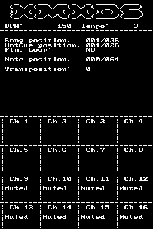

# XMXDS
## .XM deck for Nintendo DS

XMXDS (.XM miX for nintendo DS) is a simple player (with support up to 16 channels) to playback .xm files on Nintendo DS.

Inspired by PT-1210 for Amiga, it supports all the controls to use your Nintendo DS as a DJ deck.

Built on top of [libxm7](https://github.com/sverx/libxm7).

Note: the software is intended for usage on real hardware. 
File navigation will not work unless using real hardware, or unless including the .xm files in the data folder at compile time (you will need to recompile).

Distributed under MIT license.

## Controls
- A: Start and stop.
- B: Set Hot Cue position to current pattern
- B + LEFT / RIGHT: Move Hot Cue position -1 / +1
- Y: Jump to Hot Cue pattern at next pattern break
- X: Enable / disable pattern loop
- UP / DOWN: Bpm -1 / +1
- LEFT / RIGHT: Nudge -1 / +1 
- L / R: Note transpose -1 / +1
- SELECT: Open module selection menu
- Touch: mute / unmute channels